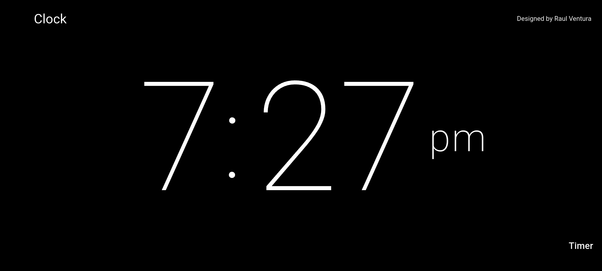
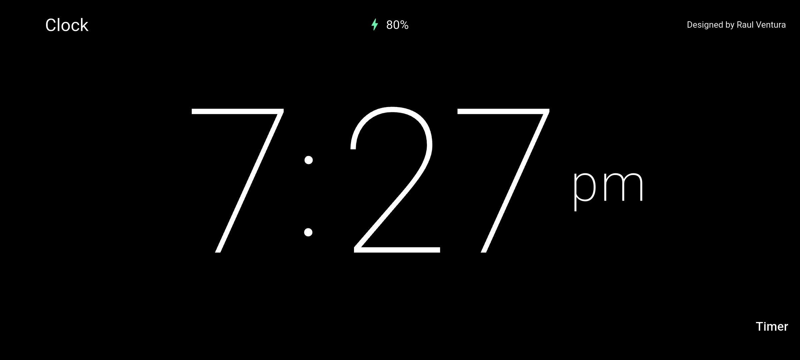
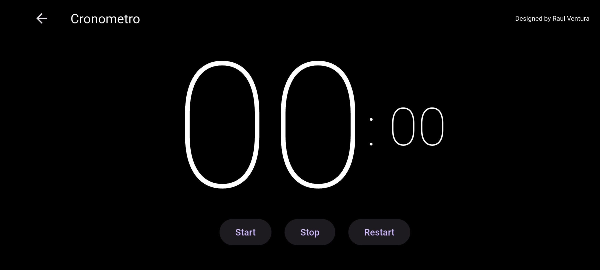

# Timer App

Esta aplicacion tiene 2 funcionalidades

## Funcionalidad de Hora

La aplicacion muestra en formato de 12hrs la hora actual

En el caso que el telefono este cargando mostrara el icono y el porcentaje de carga

Presionando el boton "Timer" nos llevara a la siguiente pantalla

## Funcionalidad de Timer

En esta pantalla el teledono proporciona 3 botones para iniciar, detener y reiniciar el cronometro

